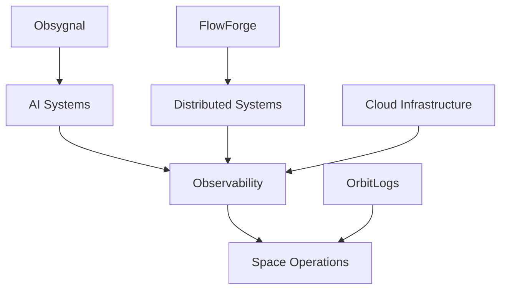

````markdown


<div align="center">

# 👋 Hello, I'm Bikram Sarkar

### Senior Infrastructure Engineer • Rust Enthusiast • AI Systems Builder • Open Source

> **Building software at the intersection of Infrastructure Engineering, Distributed Systems, AI, and Space Technology.**

My mission is simple:

**Build reliable software that powers the next generation of AI infrastructure and space operations.**

<br>

[](https://github.com/sarkarbikram90)

[](https://linkedin.com/in/bikramsarkar)


</div>

---

# 🚀 Mission

> **Engineering reliable systems for AI, Cloud and Space.**

I'm passionate about building systems that are:

- Reliable
- Observable
- Distributed
- Automated
- Scalable

Current focus:

- 🤖 AI Infrastructure
- ⚡ Distributed Systems
- 📊 Observability
- ☁ Cloud Native Platforms
- 🛰 Space Operations
- ❤️ Open Source

---

# 📜 mission.toml

```toml
[identity]

name = "Bikram Sarkar"

role = "Senior Infrastructure Engineer"

mission = """
Build software powering
AI Infrastructure,
Distributed Systems,
and Space Operations.
"""

currently_building = [
  "OrbitLogs",
  "Obsygnal",
  "FlowForge"
]

currently_learning = [
  "Rust",
  "Distributed Systems",
  "Satellite Communications",
  "ADCS",
  "Machine Learning"
]
```

---

# 🚀 Flagship Projects

## 🛰 OrbitLogs

### Open Source Mission Operations Platform

Building a modern satellite operations platform powered by Rust.

**Tech**

- Rust
- Kafka
- PostgreSQL
- TimescaleDB
- Prometheus
- Grafana
- Docker

Current Progress

```text
Telemetry Simulator        ██████████████░░░ 70%

Rust Collector             ██████████░░░░░░ 55%

Mission Dashboard          ███████░░░░░░░░░ 40%

Alert Engine               █████░░░░░░░░░░░ 30%

AI Anomaly Detection       ███░░░░░░░░░░░░░ 20%
```

---

## ⚡ Obsygnal

### AI Infrastructure Intelligence Platform

Helping engineering teams operate AI systems reliably.

Focus Areas

- GPU Optimization
- LLM Monitoring
- AI Observability
- RAG Evaluation
- Infrastructure Intelligence
- Cost Optimization

---

## ⚙️ FlowForge

### Distributed Workflow Scheduler

A lightweight workflow orchestration engine built with Rust.

Goals

- Async Execution
- Fault Tolerance
- Distributed Scheduling
- High Performance
- Horizontal Scalability

---

# 🧠 Engineering Domains

| Domain | Technologies |
|---------|--------------|
| 🦀 Systems Programming | Rust • Go |
| ☁ Cloud Infrastructure | AWS • Kubernetes • Docker |
| 🤖 AI Engineering | Python • PyTorch • Scikit-learn |
| 📊 Observability | Grafana • Prometheus • OpenTelemetry |
| ⚙ Infrastructure Automation | Terraform • GitHub Actions |
| 🛰 Space Systems | Telemetry • Ground Systems • Mission Operations |
| 🗄 Databases | PostgreSQL • TimescaleDB • Redis |

---

# 📚 Current Learning

```text
██████████████████████░ Rust

████████████████████░░ Distributed Systems

██████████████████░░░ AI Infrastructure

████████████████░░░░ Observability

██████████████░░░░░ Satellite Systems

████████████░░░░░░ Machine Learning

██████████░░░░░░░░ ADCS

████████░░░░░░░░░░ Orbital Mechanics
```

---

# 🗺 Engineering Roadmap

## 2026

- ✅ Build OrbitLogs MVP
- ✅ Build FlowForge
- ✅ Launch Obsygnal
- 🔲 Publish Technical Blogs
- 🔲 Contribute to Rust Open Source
- 🔲 Learn Satellite Flight Software
- 🔲 Build AI Infrastructure Products
- 🔲 Become a recognized OSS contributor

---

# 💡 Engineering Principles

```text
Build before optimizing.

Automate repetitive work.

Measure before making assumptions.

Reliability is a feature.

Prefer simplicity.

Think in systems.

Documentation scales engineering.

Solve real-world problems.
```

---

# 🏗 Architecture Interests



---

# ⚙️ Tech Stack

## Languages


---

## Cloud


---

## Observability


---

# 📈 GitHub Analytics

<div align="center">


</div>

---

## 🔥 Contribution Streak

<div align="center">


</div>

**This widget automatically displays:**

- ✅ Total Contributions
- ✅ Current Streak
- ✅ Longest Streak

---

## 📊 Contribution Graph

<div align="center">


</div>

---

## 📈 GitHub Summary

<div align="center">


</div>

---

## 🏆 GitHub Trophies

<div align="center">


</div>

---

# 🌍 Building in Public

I enjoy sharing my learning journey around:

- 🦀 Rust
- 🤖 AI Infrastructure
- ⚡ Distributed Systems
- ☁ Cloud Engineering
- 📊 Observability
- 🛰 Space Technology
- 🛠 System Design
- ❤️ Open Source

---

# 🤝 Let's Connect

I'm always interested in conversations about:

- Distributed Systems
- AI Infrastructure
- Rust
- Observability
- Cloud Native Engineering
- Satellite Software
- Open Source

---

<div align="center">

## ⭐ Building software that powers the next generation of AI and Space Infrastructure.

If you enjoy my work or find my projects useful, consider giving them a ⭐ and following my journey.

<br>


</div>
````
